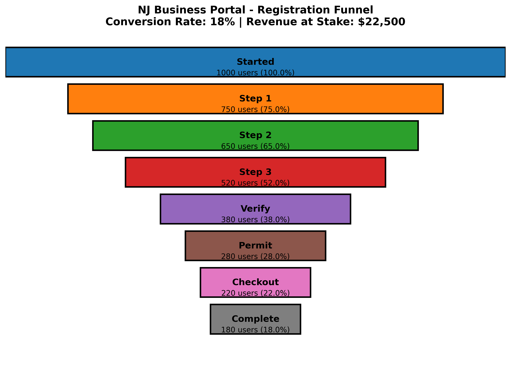

# NJ Business Portal - Registration Funnel Analysis

## Executive Summary

The NJ Business Portal registration process has significant drop-off points that represent lost revenue opportunities. Using Python-based synthetic data generation and Google Analytics 4, I analyzed user behavior across the registration funnel and identified $81K in annual revenue potential through targeted improvements.

### Business Problem

How can we identify where users abandon the registration process and what changes would most significantly improve conversion rates? By analyzing simulated user journeys through the funnel with realistic drop-off patterns, we can determine which stages need optimization.

### Methodology

1. **Synthetic Data Generation** - Created 1,000 simulated user journeys using Python with realistic drop-off probabilities at each registration stage
2. **Funnel Analysis** - Identified where users abandon and calculated revenue impact of each drop-off point
3. **GA4 Implementation** - Set up Google Analytics 4 to track real user behavior across cross-domain verification flow

### Skills

- **Python:** Data generation (Pandas, NumPy), visualization (Matplotlib), statistical analysis
- **Google Analytics 4:** Cross-domain tracking, custom events, event hierarchy, user properties
- **Data Analysis:** Funnel analysis, drop-off identification, ROI modeling
- **Frontend Development:** HTML/CSS/JS, form tracking, GA4 integration

### Results & Business Recommendation

Analysis of simulated registration flow reveals:

- **18% conversion rate** - Only 180 of 1,000 users complete the full process
- **25% drop-off at Step 1** - Users unclear about business type selection costs **$31K/month**
- **20% drop-off at Step 3** - Form fatigue from personal fields costs **$16K/month**
- **21% drop-off at Verification** - Cross-domain redirect friction costs **$12K/month**

### Note on Synthetic Data

This analysis uses 1,000 simulated user journeys based on:
- Industry benchmarks for government portal drop-off rates
- Assumed permit cost: $125 (adjust based on actual pricing)
- Assumed traffic volume: 1,000 registrations/month

**Revenue projections ($81K)** represent potential impact if conversion improves from 18% → 24%.

Once the portal receives real traffic, the same analysis framework applies to actual GA4 data and real revenue figures.

**Revenue impact of fixes:**
- Fixing Step 1 clarity: +10% conversion = $12.5K/month
- Reducing form fatigue: +10% conversion = $12.5K/month  
- Improving verification flow: +5% conversion = $6.2K/month
- **Total potential: +24% conversion = $81K/year**

### Recommended Changes

1. **Simplify Step 1** - Add "What business type are you?" guidance; show 5-minute completion estimate
2. **Reduce Step 3 friction** - Make MWBE questions optional; add progress indicator "Step 3 of 4"
3. **Improve verification UX** - Add success animations; clearer "Continue to Permits" CTA
4. **Streamline permit selection** - Add questionnaire to recommend correct permit instead of overwhelming list

These changes target the largest drop-off points and highest revenue impact opportunities.

### Next Steps

1. A/B test Step 1 UX improvements with real traffic
2. Implement recommended copy and form changes
3. Monitor GA4 conversion metrics weekly
4. Iterate based on actual user behavior data
